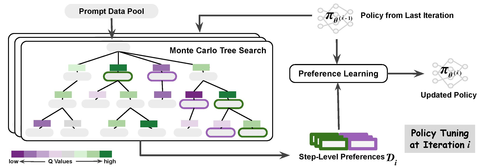

# Monte Carlo Tree Search Boosts Reasoning via Iterative Preference Learning

This repository contains code and analysis for the paper: [Monte Carlo Tree Search Boosts Reasoning via Iterative Preference Learning](https://arxiv.org/abs/2405.00451). 
Below is the framework of our proposed method.



#### Environment Setup

```sh
conda env create --file conda-recipe.yaml
pip install -r requirements.txt
```

#### Dataset Download

* Arithmo: [akjindal53244/Arithmo-Data](https://huggingface.co/datasets/akjindal53244/Arithmo-Data)

* GSM8K: [openai/grade-school-math](https://github.com/openai/grade-school-math/tree/master/grade_school_math/data)

* MATH: [hendrycks/math](https://github.com/hendrycks/math/)

* ARC: [AI2 Reasoning Challenge](https://paperswithcode.com/dataset/arc)

* AI2S: [AI2 Science Questions](http://data.allenai.org/ai2-science-questions)

* OBQA: [Openbook QA](https://allenai.org/data/open-book-qa)

* CSQA: [tau/commonsense_qa](https://huggingface.co/datasets/tau/commonsense_qa)

* SciQ: [SciQ Dataset](https://allenai.org/data/sciq)


#### Run MCTS-DPO

Our main code include `./mcts_rl/algorithms/mcts` and `./mcts_rl/trainers/tsrl_trainer.py`

To run MCTS-DPO for MathQA on Mistral (SFT):
```sh
bash scripts/mcts_mathqa.sh
```

To run MCTS-DPO for CSR on Mistral (SFT):
```sh
bash scripts/mcts_csr.sh
```

## Citation

```
@article{xie2024monte,
  title={Monte Carlo Tree Search Boosts Reasoning via Iterative Preference Learning},
  author={Xie, Yuxi and Goyal, Anirudh and Zheng, Wenyue and Kan, Min-Yen and Lillicrap, Timothy P and Kawaguchi, Kenji and Shieh, Michael},
  journal={arXiv preprint arXiv:2405.00451},
  year={2024}
}
```

---
<sub><sup>This repository is adapted from the code of the works [Safe-RLHF](https://github.com/PKU-Alignment/safe-rlhf). </sup></sub>
